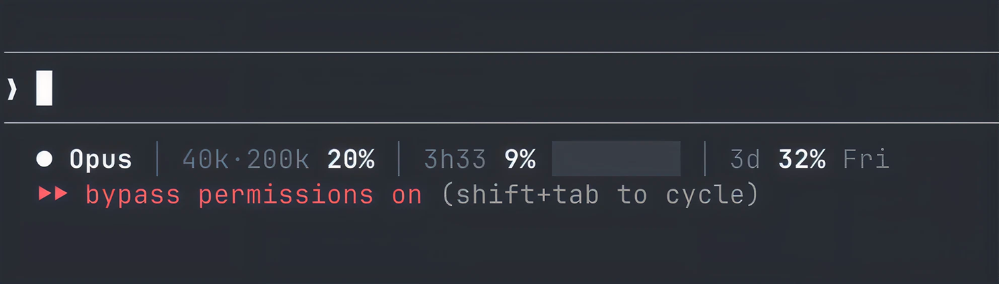

# ● claude-pulse

> The vital signs of your Claude Code session. Because flying blind with a rate limit is like playing Dark Souls without the health bar.



## What you get

- **Context window** — tokens used vs total, so you know if you're in 200k or 1M mode
- **Reasoning effort** — pinned next to the model name, live through mid-session `/effort` changes
- **5h rate limit** — live countdown + percentage + visual bar. No more surprise throttling
- **7d weekly quota** — because burning 80% on Monday is a lifestyle choice
- **Smart colors** — white when chill, amber at 50%, red at 80%. Pulse animation when you're cooked
- **Last done** — an optional second row telling you what Claude just finished, so you can look away and come back
- **Spike damping** — no false 100% spikes from API hiccups
- **Atomic writes** — no race conditions between concurrent refreshes

## Install

```bash
curl -sS https://raw.githubusercontent.com/Haidy-ID/claude-pulse/main/install.sh | bash
```

Restart Claude Code. That's it.

## Codex variant

Codex CLI does not expose a Claude Code-style `statusline` shell hook, so [`codex-pulse/`](codex-pulse/) ships a graphical sidecar instead. It reads Codex's local session events, renders the missing bars, and also configures the native `tui.status_line` as a fallback.

```bash
cd codex-pulse
./install.sh
```

```bash
~/.codex/codex-pulse.sh --watch
```

### Manual install

```bash
curl -sS https://raw.githubusercontent.com/Haidy-ID/claude-pulse/main/claude-pulse.sh -o ~/.claude/claude-pulse.sh
curl -sS https://raw.githubusercontent.com/Haidy-ID/claude-pulse/main/claude-pulse-lastdone.sh -o ~/.claude/claude-pulse-lastdone.sh
chmod +x ~/.claude/claude-pulse.sh ~/.claude/claude-pulse-lastdone.sh
```

Then add to `~/.claude/settings.json`:

```json
{
  "statusLine": {
    "type": "command",
    "command": "bash ~/.claude/claude-pulse.sh"
  },
  "hooks": {
    "Stop": [
      {
        "matcher": "",
        "hooks": [
          { "type": "command", "command": "bash ~/.claude/claude-pulse-lastdone.sh", "timeout": 5 }
        ]
      }
    ]
  }
}
```

The `hooks` block only powers the **Last done** row — skip it and the status line still works, it just stays on one line. If you already have `Stop` hooks, append to the array instead of replacing it.

## Requirements

- **Claude Code** (with a Pro/Team subscription)
- **curl** + **jq** (probably already there)
- A terminal with true color support (any modern terminal)

## Compatibility

| Platform | Status |
|----------|--------|
| macOS Terminal / iTerm / Warp | ✅ |
| Windows — Git Bash | ✅ |
| Windows — WSL | ✅ |
| Linux | ✅ |

## Layout breakdown

```
● Opus·high │ 60k/200k 30% │ 2h51 2% ░░░░░░░░ │ 3j 29% Ven.
Last done: Le hook Stop écrit désormais un fichier par session.
```

| Segment | Description |
|---------|-------------|
| `● Opus` | Active model (compact name) |
| `·high` | Reasoning effort — `low`, `medium`, `high`, `xhigh`, `max` (hidden when the model has none) |
| `60k/200k` | Tokens used / context window size |
| `30%` | Context usage (white → amber → red) |
| `2h51` | Time until 5h rate limit resets |
| `2%` | Current 5h utilization |
| `██░░░░░░` | Visual progress bar |
| `3j` | Days until weekly reset |
| `29%` | Weekly quota used |
| `Ven.` | Weekly reset day (< 48h shows exact time) |
| `Last done:` | What Claude finished on its last turn (row omitted when empty) |

## Last done

A second row that answers "what did it just do?" without scrolling back up.

A `Stop` hook fires when Claude finishes a turn. It reads the `last_assistant_message` field Claude Code hands it, keeps the first line that reads like a statement — skipping code fences, headings, bullets, tables and questions — trims it to its leading sentences, and stores it under `~/.claude/pulse-lastdone/<session_id>`. The status line reads that file and wraps it to `COLUMNS`.

Per session, so switching sessions shows that session's own line. When a turn ends on a question or on nothing quotable, the previous line stays rather than blanking.

One punchy opener — "Shipped." — says nothing on its own, so the hook keeps taking sentences until it has at least `MINLEN` characters of substance. It stops early at a question: whatever came before it is still worth showing.

| Variable | Default | Effect |
|----------|---------|--------|
| `CLAUDE_PULSE_LASTDONE` | `1` | Set to `0` to hide the row (the hook keeps recording) |
| `CLAUDE_PULSE_LASTDONE_ROWS` | `2` | Max rows the summary may wrap onto |
| `CLAUDE_PULSE_LASTDONE_MINLEN` | `55` | Keep adding sentences until the summary is at least this long |
| `CLAUDE_PULSE_LASTDONE_MAXLEN` | `220` | Max characters stored per summary |
| `CLAUDE_PULSE_LASTDONE_DIR` | `~/.claude/pulse-lastdone` | Where summaries are stored |

Credit where due: the idea, the name and the collapse-to-one-line behavior are lifted from [`pi-tasks`](https://github.com/earendil-works/pi-mono), an extension for the `pi` coding agent.

## Under the hood

Stuff you didn't ask for but we built anyway:

- **Spike damping** — If the API returns a +30% jump out of nowhere, pulse ignores it and waits for confirmation on the next read. One bad API response won't make you panic
- **Atomic file writes** — Cache and state files are written to a temp file then `mv`'d into place. Two concurrent status line refreshes can't corrupt each other
- **Pulse animation** — Above 80% on the 5h gauge, the red color alternates between coral and deep red every second. Subtle enough to not be annoying, visible enough to feel the heat
- **48h precision mode** — The weekly reset shows the day name (`Ven.`), but when you're under 48h it switches to exact time (`Ven. 08h00`). Because "Friday" is vague when it's Thursday night
- **Dynamic countdown** — The `5h` label isn't static — it's a live countdown (`2h44`, `0h12`). Same for `7d` which shows days remaining (`3j`, `1j`)
- **Auto-compact model name** — `Claude Opus 4.6` becomes `Opus`. You know what model you're using, you don't need the full résumé
- **`timeout` fallback** — Git Bash on Windows doesn't always have `timeout`. Pulse detects this and skips it instead of hanging
- **Locale-free French days** — Day names (`Lun.`, `Mar.`, `Ven.`) are hardcoded from `%u` weekday numbers. Works on any system, no `fr_FR.UTF-8` locale needed
- **Colour-blind wrapping** — The Last done row is wrapped as plain text *then* colored, so ANSI escapes never leak into the width arithmetic. Claude Code doesn't hand your script a terminal, so `tput cols` returns nothing useful — pulse reads the `COLUMNS` variable Claude Code exports instead (needs v2.1.153+)
- **Fork-free hot path** — The status line re-runs on every UI event, so the Last done row is wrapped and colored entirely with bash builtins. No `head`, no `awk`, no subshell: the feature costs zero extra processes per render. It also means accented text wraps by character count rather than byte count — macOS `awk` reports `éèàùç` as 10 units long, bash reports 5, and only one of those is a terminal column
- **Never blanks on a question** — If a turn ends on a question or on nothing but code, the Last done hook exits without writing. The previous answer stays up instead of flickering to empty
- **Unit-separator field parsing** — The status JSON is unpacked with `US` (0x1f), not a tab. Tab is IFS whitespace, so bash collapses runs of them: one empty field — an absent effort level, a missing session id — would silently shift every field after it and print the model name in the wrong slot

## Configuration

Everything is off-by-default-safe and driven by environment variables. See [Last done](#last-done) for that row's own settings.

| Variable | Default | Effect |
|----------|---------|--------|
| `CLAUDE_PULSE_LANG` | auto | `en` or `fr`, for day names. Auto-detected from `LC_TIME`/`LANG` |
| `CLAUDE_PULSE_EFFORT` | `1` | Set to `0` to hide the effort segment |

## How it works

1. Reads Claude Code's status JSON from stdin (built-in hook)
2. Fetches rate limit data from Anthropic's OAuth usage API (cached 60s)
3. Renders a compact, colored status line
4. Optionally reads the Last done summary a `Stop` hook left behind for this session

No background processes. No daemon. No config files to maintain. Two bash scripts that read stdin and write a string. Peak simplicity.

## Credits

Built by [Lünn](https://github.com/Haidy-ID) during a late night Claude Code session. The irony of using Claude to build a Claude monitoring tool is not lost on us.

## License

MIT — Do whatever you want with it. If you improve it, PRs welcome.
